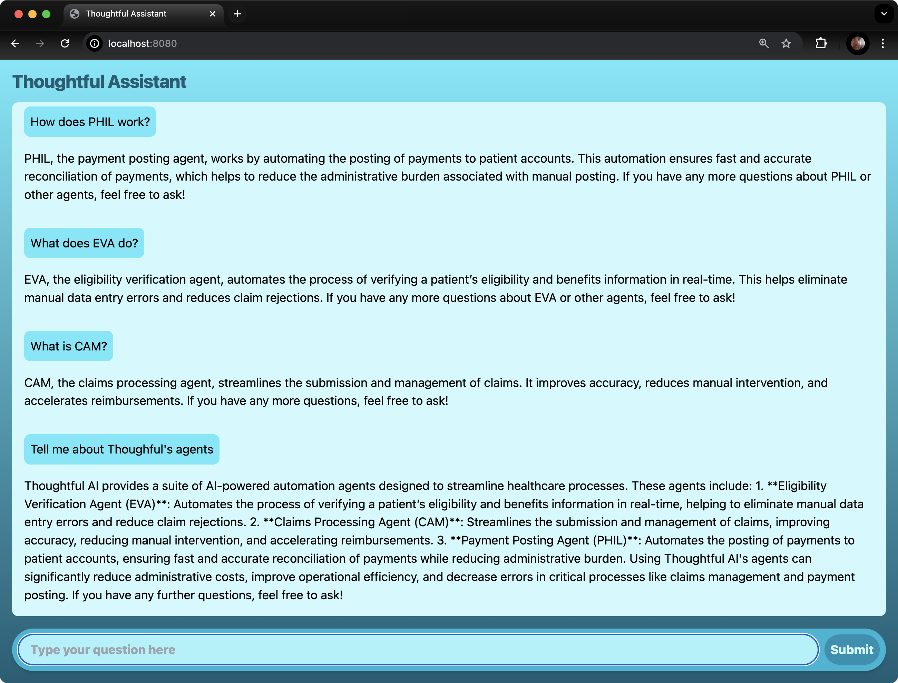

# TF Assistant

This application is built in Java, Spring Boot, and Spring AI. For simplicity's
sake, it uses an in-memory vector store, but could be easily altered to use
Chroma, pgVector, QDrant, Pinecone, or any vector store supported by Spring AI.

## Running the application

You'll need Java 17 or higher installed and available on your path. The easiest
and most flexible way to do that is to install [SDKMAN](https://sdkman.io/), and
then run:

```shell
sdk install java 17.0.1.hs-adpt
```

You'll also need to be sure to set the `OPENAI_API_KEY` environment variable to
a valid OpenAI API key obtained from [OpenAI](https://platform.openai.com/api-keys).

Then, you can run the application with:

```shell
./gradlew bootRun
```

Once the application has started, you can open it in your browser by entering
http://localhost:8080 in the address bar. From there, you can ask questions
using a typical chat interface.

## Implementation Notes

The data set is relatively small and therefore employing Retrieval Augmented Generation
(RAG) may be overkill. But I chose to do so because it's not dramatically more complicated
and allows for the set of data to grow without needed to redesign the application.

I also chose to use OpenAI as the LLM API for the application. Alternatively, you could
use Anthropic Claude, Vertex Gemini, or any other LLM API supported by Spring AI by changing
a single dependency in build.gradle and setting the appropriate environment variables for
authentication and model selection. For example, if you wanted to use llama3.2 running on
a local Ollama server, you could change the Spring AI OpenAI dependency in build.gradle to

```
implementation 'org.springframework.ai:spring-ai-ollama-spring-boot-starter'
```

And set the following configuration property in application.properties:

```
spring.ai.ollama.chat.model=llama3.2
```

## Screenshot

